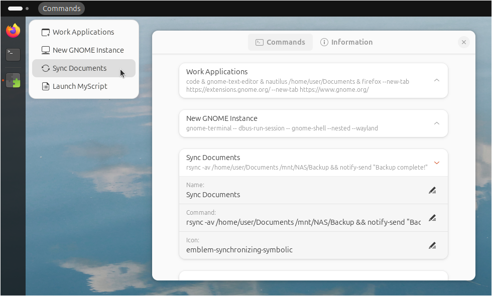
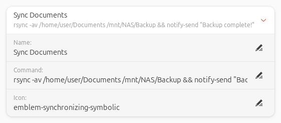

# Custom Command Menu

#### A GNOME extension to run commands from a drop-down menu.

Custom Command Menu is an extension for GNOME 45/46/47 to run user defined commands from a customizable drop-down menu at the top bar. 




<br>

## Features

- Run commands by selecting them from a drop-down menu at the top bar.
- Give each command entry a custom name and icon.
- Enter commands directly into the extension preferences window without the need for configuring any external files.
- Backup and restore the command list to an easily editable configuration file.


<br>

## Installation

<!--
### Recommended
-->

Browse for and install this extension through the GNOME Extension tool or install through the [GNOME Extensions website](https://extensions.gnome.org/extension/7024/custom-command-list/).

<!--
### Manual

1. Download the  custom-command-menu.zip file of the [latest release](https://github.com/StorageB/custom-command-menu/releases/). 
2. Run the following command from the terminal:
`gnome-extensions install --force custom-command-menu.zip`
3. Logout and login.
-->

<br>

## Configuration

From the extension's preferences, enter the terminal/shell commands to include in the drop-down menu and the associated display name for each command. If the name field is left empty, the command will not appear in the drop-down menu.

For a list of available symbolic icons to use refer to:
[GNOME default icons](https://github.com/StorageB/icons/blob/main/GNOME46Adwaita/icons.md) or
[Ubuntu Yaru icons](https://github.com/StorageB/icons/blob/main/Yaru/icons.md)

Alternatively, navigate to the icon directory for your system’s theme (located at /usr/share/icons), or use the [Icon Library app](https://flathub.org/apps/org.gnome.design.IconLibrary).

Enter the name of the icon without the file extension. Note that icon appearance will vary depending on your systems's theme.



Command tips:
- Run multiple commands by using `&` between commands.
- Chain multiple commands together to run one at a time using `&&` between commands.
- By default, commands do not run in a terminal window and will not show any output or error messages. Test the full command first by running it in the terminal before adding it to the extension to verify it is correct. 
- To run a command in a terminal window, use `gnome-terminal -- command`. Note that by default the GNOME terminal will close after the command is complete, but that can be changed in the terminal preferences if needed.
- Sudo commands require a password input from the terminal, so they will not directly work by themselves since commands run without a terminal window by default. However, you can use `gnome-terminal -- command` to run the command in the terminal. For example, `gnome-terminal -- sudo apt-get update` will open a terminal, prompt for your password, and then run the command.

<br>

## Backup and Restore

The export option will save the current list of commands, along with their associated names and icons, to a commands.ini file in the user's home directory. The import option restores commands from the commands.ini file overwriting the existing list of commands.

Example commands.ini entry:
```
[Command 1]
Name=Hello world!
Command=notify-send "Custom Command Menu" "Hello world!"
Icon=face-smile-symbolic
```

<br>

## License

This project is licensed under the [GNU General Public License](http://www.gnu.org/licenses/).

<br>

#### I hope you found this extension useful!

<a href="https://www.buymeacoffee.com/StorageB" target="_blank"></a>
