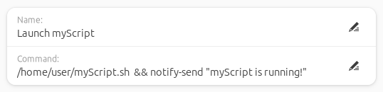

# Custom Command List

#### A GNOME extension to run shell commands from a drop-down menu.

Custom Command List is a GNOME extension to run user defined terminal/shell commands by selecting them from a drop-down menu at the top bar. 

 

 

## Installation

Browse for and install this extension through the GNOME Extension tool or install through the [GNOME Extensions website](https://extensions.gnome.org/extension/7024/custom-command-list/).

 

## Configuration

From the extension's preferences, enter the terminal/shell commands to include in the drop-down menu and the associated display name for each command. If the name field is left empty, the command will not appear in the drop-down menu.

Tips:
- Run multiple commands by using `&` between commands.
- Chain multiple commands together to run one at a time using `&&` between commands.
- Test the full command first by running it in the terminal before adding it to the extension to verify it is correct. Note that because the command is not running in a terminal window, there will not be any output or error messages.

 

## Usage Examples and Suggestions

Here are some ideas on how this extension can be used:
- Create a command that automatically launches all the applications and web pages you need opened.
- Launch custom bash scripts or python scripts.
- Create a command to create a backup of your documents.

 

## Contributing

Contributions are welcome! Feel free to open an issue or submit a pull request to contribute to this project.

 

## License

This project is licensed under the [GNU General Public License](http://www.gnu.org/licenses/).

 

#### I hope you found this extension helpful!

