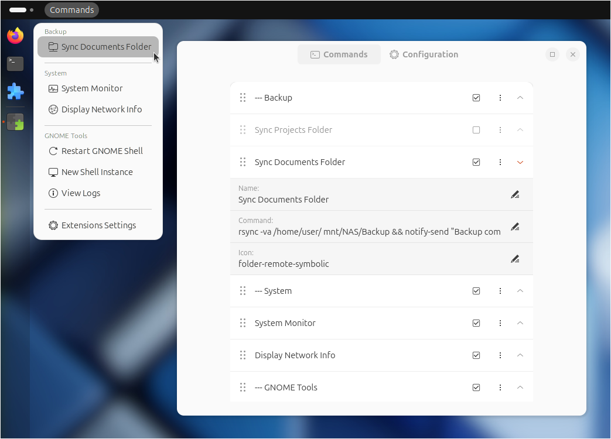
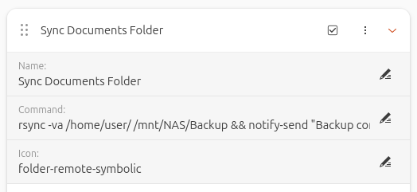

# Custom Command Menu

#### A GNOME extension to run commands from a drop-down menu.

Custom Command Menu is an extension for GNOME 45/46/47/48 to run user-defined commands from a customizable drop-down menu at the top bar. 



<br>

## Features

- Run commands from a drop-down menu at the top bar.
- Configure commands directly from the extension preferences without the need for configuring any external files.
- Give each command entry a custom name and icon.
- Drag-and-drop to reorder commands.
- Toggle visibility of individual commands.
- Create standard or labeled separators in the menu.
- Export and import command list using an easily editable configuration file.


<br>

## Installation


### Recommended

Browse for and install this extension through the GNOME Extension Manager app or the [GNOME Extensions website](https://extensions.gnome.org/extension/7024/custom-command-list/).


### Manual

1. Download the `custom-command-menu.zip` file of the [latest release](https://github.com/StorageB/custom-command-menu/releases/). 
2. In the terminal run:
`gnome-extensions install --force custom-command-menu.zip`
3. Logout and login.

To enable and configure the extension:
```
gnome-extensions enable custom-command-list@storageb.github.com
gnome-extensions prefs custom-command-list@storageb.github.com
```

<br>

## Configuration

Open the extension preferences via the Extension Manager or run
`gnome-extensions prefs custom-command-list@storageb.github.com`



### Commands

Enter a name and command for each entry to include it in the drop-down menu.
- Type --- or ~~~ in the name field to create a visual separator line in the menu.
- Adding text after --- or ~~~ creates a labeled separator.
- Use the **☑ checkbox** to toggle a command's visibility.
- Select the **⋮ more options** button to duplicate or delete a command.

Command tips:
- Run multiple commands in parallel by using `&` between commands.
- Run multiple commands one at a time using `&&` between commands.
- Commands run silently (no terminal output), so test the full command in a terminal before adding it to the menu. 
- To run a command in a terminal window, use `gnome-terminal -- command`. Note that by default the GNOME terminal will close after the command is complete, but that can be changed in the terminal preferences if needed.
- For sudo commands that require a password, use `pkexec` before the command to get a password prompt. For example, `pkexec sudo command` prompts for your password and then runs the command. Alternatively, use `gnome-terminal -- sudo command` to open a terminal where you can enter your password.
- To open the command configuration window for this extension directly, use the command `gnome-extensions prefs custom-command-list@storageb.github.com`.

### Icons

Enter the name of a system icon (without the file extension). 
**For a list of available symbolic icons refer to:**
- [GNOME default icons](https://github.com/StorageB/icons/blob/main/GNOME48Adwaita/icons.md)
- [Ubuntu Yaru icons](https://github.com/StorageB/icons/blob/main/Yaru/icons.md)

Alternatively, browse the icon directory for your system’s theme (typically /usr/share/icons), or use the [Icon Library app](https://flathub.org/apps/org.gnome.design.IconLibrary).

To use a custom icon, place an SVG icon in: `~/.local/share/icons/hicolor/scalable/apps/`. Reboot and then enter the icon name (without the file extension). 


<br>

## Backup and Restore

Use the import/export buttons in the preferences window to save or load the command list. Exporting will create an editable commands.ini file in your home directory.

Example commands.ini entry:
```
[Command 1]
Name=Hello world!
Command=notify-send "Custom Command Menu" "Hello world!"
Icon=face-smile-symbolic
Visible=true
```

<br>

## License

This project is licensed under the [GNU General Public License](http://www.gnu.org/licenses/).

<br>

#### I hope you found this extension useful!

<a href="https://www.buymeacoffee.com/StorageB" target="_blank"></a>
